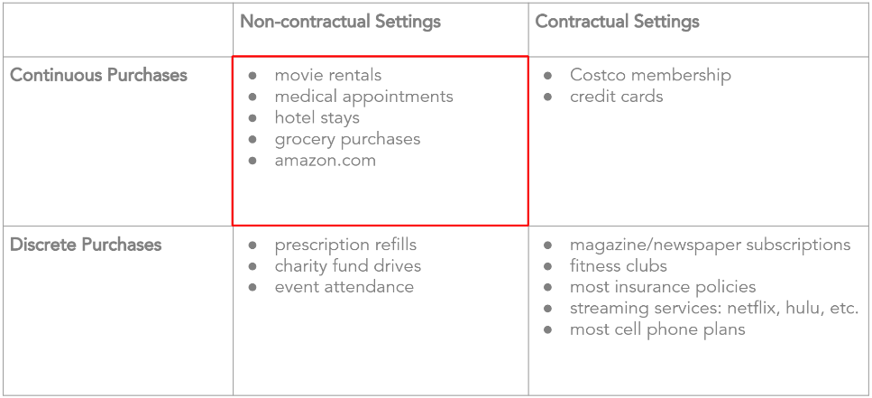
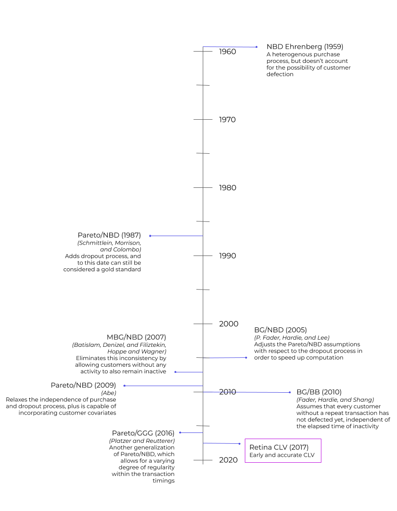
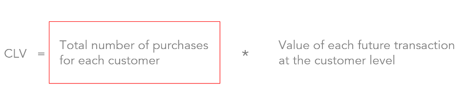
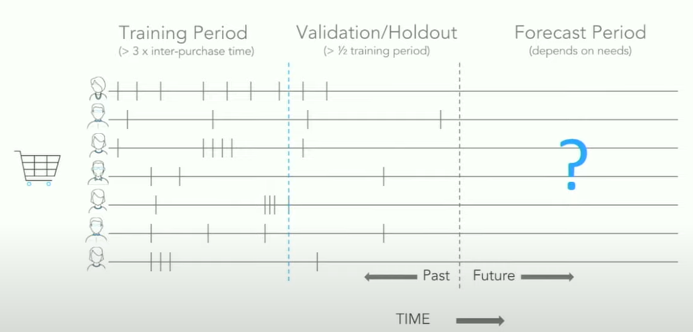

# Predicting Customer Lifetime Value using Machine Learning

## What is CLV?
**CLV** or **Customer Lifetime Value** represents the total anticipated value a customer will bring throughout their relationship with a business.  
While CLV sounds like a value derived over a customer’s entire lifetime, we typically predict the value over a fixed period of time, say 12 months or 24 months.  
The selection of the lifetime period depends on the customer’s average survival period within the business & should be long enough to represent their lifetime value adequately.  

## Why should businesses care about CLV?
- Segment customers to identify most profitable customers.
- Identify traits and features of these valuable customers.
- Determine how to allocate resources among different customers that the business have.
- Benchmark for setting Customer Acquisition Costs.  

Modelling CLV holds significant importance for businesses aiming to maximize profitability & enhancing customer retention.  

## Business contexts
There are two kinds of business setting in CLV context - **Contractual** & **Non-Contractual**.

#### Contractual  
A business setting where customer death is observed.  
Typical subscription based businesses. For example, Netflix.  
If someone doesn't renew their subscription, we know that customer has left the business.  

#### Non-Contractual  
A business setting where customer death is unobserved.  
Common among online retailers. For example, Amazon.  

#### Discrete vs Continuous Purchases  
Discrete purchases occur at fixed periods or frequencies.  
For example, Buying a specific magazine every month or monthly prescription refill.  

Continuous purchases can happen anytime.  
For example, Buying a phone case from Amazon or getting a shoe from Ebay.  

***More examples of Business Contexts***  

  

## Timeline of various CLV models  
  

## Data for training CLV models
To train CLV model, we mainly require the following data for each customer - Recency, Frequency, Monetary value (RFM).  
This is created from the transactions (or sales) data.  

**Recency:** When was the most recent purchase for a customer.  
**Frequency:** Number of purchases for a customer.  
**Monetary Value:** Average value of the purchases for a customer.  

Together, they are called RFM Matrix.  
RFM is a marketing analysis model that helps segment the consumer base by their purchasing patterns or habits.  
Important information to model CLV.  

## Modeling ("Buy Till You Die")

**Transaction Process**  
Every customer has an underlying, unobservable purchasing rate.  
While active, a customer purchase randomly around his/her mean transaction rate.  
Transaction rates vary across customers.  
For example, a customer could purchase once every week or it could be once every month.  
Sometimes a customer becomes active, buy a lot of stuff, and then go inactive/cold for whatever reason.  
We may bring in all kinds of features to explain why customer became inactive.  

**Drop Out process**  
Every customer has an unobserved drop out propensity.  
Customers may buy in a steady rate, and then the rate drop to zero and never buy again.  
Drop out process also vary across customers.  

**CLV equation**

These two parts are modelled separately and attached afterwards.  
You will see this done in my project.  

## Training vs Holdout vs Forecast period

We split the RFM dataset into training & holdout/validation set.  
Training set is used to train the model, and we evaluate the model based on holdout set.  
While selecting the holdout period for validation, if the customers are typically purchasing every month, selecting 2 weeks of holdout period is meaningless.  We have to select a meaningful period for holdout to have a good idea about the model performance.  
For the holdout set, the standard way is to use 1/2 the training period.  

## My project  
Find my sample project here. [Notebook.](https://github.com/rrsankar/CLV-Prediction-Using-ML/blob/main/CLV_using_Lifetimes_BGNBD_GammaGamma/main.ipynb)  
In this project, I used the BG/NBD & Gamma Gamma model from Lifetimes package to predict the number of future transactions & the monetary value associated with each of those transactions respectively.  
More explanation provided in the notebook.  
The data used in this project can be found here: [dataset](https://archive.ics.uci.edu/dataset/502/online+retail+ii)    

## Conclusion
The goal of this project is to have a good understanding of CLV modeling and have a groundwork for my future experiments in CLV.  

## References  
[Presentation by Peter Fader at Wharton](https://www.youtube.com/watch?v=guj2gVEEx4s)  
[Talk on CLV modeling by Jean-Rene Gauthier, Ben Van Dyke during PyData Seattle 2017](https://www.youtube.com/watch?v=gx6oHqpRgpY)  
[History of Buy Till You Die (BTYD) Models](https://retina.ai/academy/lesson/history-of-buy-til-you-die-btyd-models/)
